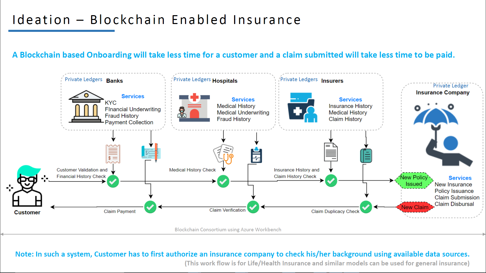
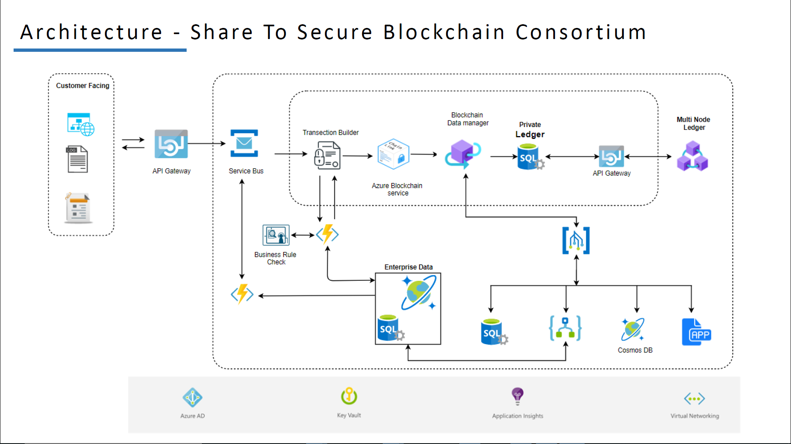

1st Runner's Up - Hackerearth Microsoft Azure Hackathon (Theme: Insurance & Banking) :trophy: :tada:
==================================================================
Share to Secure Application for Blockchain Enabled Insurance on Azure Blockchain Workbench
---------

Overview 
---------

Insurance systems need a reform. First, we need to digitize and securely share claims data and other associated data (health records for health insurance, automobile records for auto insurance, etc.) across stakeholders. Second, we need to codify business rules and automate claims processing, such that payments are automatically and quickly transferred when claims are verified. 

### SHARE TO SECURE Blockchain solution can help by enabling secure data sharing and claims processing: 

**Shared view of truth:** A blockchain system would allow same-time access to the shared truth on patient health (past and present), processing status of the current claim, the history of past claims, etc. This shared database should be permissioned, such that the various parties may only read or write fragments of data that pertain to them. 

**Programmable transfers:** In a ‘smart contract’ enabled solution - when the encoded conditions are met (e.g. a claim is validated), funds can instantly and frictionlessly be transferred from source (insurer) to destination (consumer). Insurance is a use case requiring financial exchange, and blockchains provide the unique ability to handle financial exchange on the same platform as the information system. 

**Transparency for relevant institutions:** A blockchain would remove the need for unnecessary middlemen and force integrity and accountability upon those that may previously have been corrupt. The insurance process would benefit from a system in which no party owns the data yet multiple stakeholders can view and modify it – where all have same-time access to the shared truth on patient health (past and present), processing status of the current claim, the history of past claims, etc. 

Ideation 
---------

Architecture 
---------

Deployment of Azure Workbench
------------------

[Deployment of Azure Blockchain Workbench](https://docs.microsoft.com/en-us/azure/blockchain/workbench/deploy)

Application Roles 
------------------

| Name                   | Description                                            |
|------------------------|--------------------------------------------------------|
| Owner/Buyer            | The buyer of the insurance policy.                     |
| Insurance Provider     | The Insurance Company.                                 |
| Bank Underwriter       | The bank which will perform financial underwriting.    |
| CurrentAuthorizedUser  | The hospital which will perform medical underwriting.  |

Workflow Details
-----------------

## Services needed to be deployed on Azure:

- [ ] Azure Cosmos DB
- [ ] Cosmos DB - Gremlin API
- [ ] Azure Blockchain Service
- [ ] Service Bus
- [ ] Event Grid
- [ ] Logic Apps
- [ ] Key Vault
- [ ] Azure Functions
- [ ] API Gateway
- [ ] Computer Vision

Application Files
-----------------
[ShareToSecure.json](./Application-Files/ShareToSecure.json)

[ShareToSecure.sol](./Application-Files/ShareToSecure.sol)
